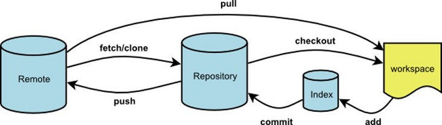
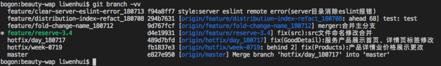
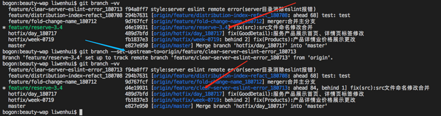
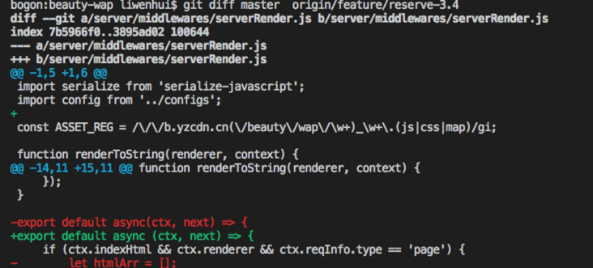
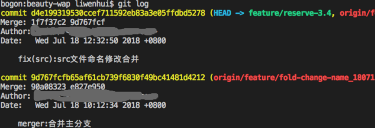
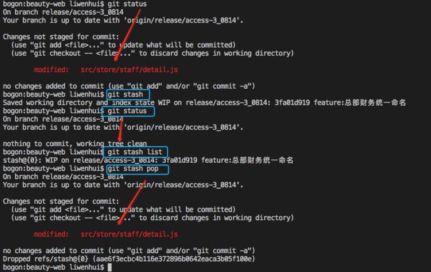

# branch

- 创建一个新分支:  `git checkout -b some_branch_name`

```bash
git branch 
git checkout 
```

- 初次提交，本地仓库不是 `git clone` 下来的，需要先 `init`

  ```bash
  git init
  git add --all
  git commit -m "first commit"
  
  git remote add origin https://github.com/xiaochenha/SpingbootMyBatisPlus.git ##
  git push origin master
  ```

  - `git remote add`

  ```bash
  git remote add [-t <branch>] [-m <master>] [-f] [--[no-]tags] [--mirror=(fetch|push)] <name> <url>
  ```

  


## 创建新分支

1. Create a new branch:
   `git checkout -b feature_branch_name`
2. Edit, add and commit your files.
3. Push your branch to the remote repository:
   `git push -u origin feature_branch_name`

```powershell
git clone --branch <branchname> <remote-repo-url>
```

## Basics

- 使用Git下载指定分支命令为：`git clone -b 分支名仓库地址`
- **初始开发git操作流程**
  - 本地创建公钥`ssh-keygen -t rsa -C "邮箱"`并配置
  - 克隆最新主分支项目代码`git clone 地址`
  - 创建本地分支`git branch 分支名`
  - 查看本地分支`git branch`
  - 查看远程分支`git branch -a`
  - 切换分支`git checkout 分支名`(一般修改未提交则无法切换，大小写问题经常会有，可强制切换`git checkout 分支名 -f`非必须慎用)
  - 将本地分支推送到远程分支`git push <远程仓库> <本地分支>:<远程分支>`


- **概念：**



1. **Remote:**远程主仓库；
2. **Repository：**本地仓库；
3. **Index：**Git追踪树,暂存区；
4. **workspace：**本地工作区（即你编辑器的代码）

- 一般操作流程：《工作区》-> `git status`查看状态 -> `git add .`将所有修改加入暂存区-> `git commit -m "提交描述"`将代码提交到本地仓库->`git push`将本地仓库代码更新到远程仓库


### 一、git remote

- 为远程仓库指定别名，以便于管理远程主机，默认只有一个时为origin

1. 查看主机名：`git remote`
2. 查看主机名即网址：`git remote -v`
   - 默认克隆远程仓库到本地时，远程主机为origin，如需指定别名可使用`git clone -o <别名> <远程git地址>`
3. 查看主机的详细信息`git remote show <主机名>`
4. 添加远程主机`git remote add <主机名> <网址>`
5. 删除远程主机`git remote rm <主机名>`
6. 修改远程主机的别名：`git remote rename <原主机名> <新主机名>`

------

### 二、git fetch

- 将某个远程主机的更新，全部/分支 取回本地（此时之更新了Repository）它取回的代码对你本地的开发代码没有影响，如需彻底更新需合并或使用`git pull`

1. 远程主机的更新，全部取回本地`git fetch <远程主机名>`；
2. 将远程仓库特定分支更新到本地`git fetch <远程主机名> <分支名>`

- 如果需要将更新拉取但本地工作代码需要合并到本地某一分支`git merge <被合并的远程分支>`或者在此基础上创建出新分支并切换`git checkout -b <分支名> <在此分支上创建>`

------

### 三、git pull

- 拉取远程主机某分支的更新，再与本地的指定分支合并（相当与fetch加上了合并分支功能的操作）

1. 拉取远程某分支并与本地某一分支合并（没有则默认会创建）：`git pull <远程主机名> <远程分支名>:<本地分支名>`
2. 如果远程分支是与当前所在分支合并，则冒号后面的部分可以省略：`git pull <远程主机名> <远程分支名>`
3. 如果当前分支与远程分支存在追踪关系,则可以省略远程分支名：`git pull <远程主机名>`
4. 如果当前分支只有一个追踪分支，则远程主机名都可以省略：`git pull`

### 三、git push

- 将本地分支的更新，推送到远程主机，其命令格式与`git pull`相似

1. 将本地分支推送到远程分支：`git push <远程主机名> <本地分支名>:<远程分支名>`
2. 如果省略远程分支名，则默认为将本地分支推送到与之关联的远程分支：(一般设置本地分支和与之关联的远程分支同名，防止混淆)`git push <远程主机名> <本地分支名>`
   - 如果对应的远程分支不存在，则会被创建（m默认与本地分支同名）
3. 如果省略本地分支名，则表示删除指定的远程分支，这等同于推送一个空的本地分支到对应远程分支：`git push origin :<远程分支>` 等同于 `git push origin --delete <远程分支>`
4. 如果当前分支与远程分支之间存在追踪关系，则本地分支和远程分支都可以省略`git push origin`
5. 如果当前分支只有一个追踪分支，那么主机名也可以省略：`git push`
6. 如果当前分支与多个主机存在追踪关系(使用场景相对来说较少)，可以使用-u指定默认推送主机`git push -u origin <主机名>`设置时候需推送便可以直接使用`git push`
7. 将本地的所有分支都推送到远程主机:`git push --all origin`
8. 如果远程主机的版本比本地版本更新，推送时Git会报错，要求先在本地做`git pull`合并差异，然后再推送到远程主机。如果一定要推送，可以使用`--force`选项(谨慎使用，除非你非常确认):`git push --force origin`

- **注意**:分支推送顺序的格式为**<来源地>:<目的地>**，所以`git pull`格式：**<远程分支>:<本地分支>**，`git push`格式为：**<本地分支>:<远程分支>**。

------

### 四、分支操作

1. 创建本地分支：`git branch test`:(创建名为test的本地分支)
2. 切换分支：`git checkout test`:(切换到test分支)
3. 创建并切换分支`git checkout -b test`:(相当于以上两条命令的合并)
4. 查看本地分支：`git branch`
5. 查看远程仓库所有分支：`git branch -a`
6. 删除本地分支：`git branch -d test`:(删除本地test分支)
7. 分支合并：`git merge master`:(将master分支合并到当前分支)
8. 本地分支重命名:`git branch -m oldName newName`
9. 远程分支重命名:
   1. 重命名远程分支对应的本地分支:`git branch -m oldName newName`;
   2. 删除远程分支:`git push --delete origin oldName`;
   3. 上传新命名的本地分支:`git push origin newName`;
   4. 把修改后的本地分支与远程分支关联:`git branch --set-upstream-to origin/newName`

- **分支关联：**

1. 查看当前的本地分支与远程分支的关联关系:`git branch -vv`



1. 把当前本地分支与远程origin的某分支进行关联处理(通过 --set-upstream-to 命令):`git branch --set-upstream-to=origin/feature/clear-server-eslint-error_180713`



- **分支差异查看**

1. 查看本地当前分支与远程某一分支的差异：`git diff origin/feature/reserve-3.4`
2. 查看本地特定分支与远程分支的差异：`git diff master origin/feature/reserve-3.4 `(查看本地master分支与远程feature/reserve-3.4分支的差异，如图)



------

### 五、修改撤销

1. `git checkout -- <文件名>`：丢弃工作区的修改，就是让这个文件回到最近一次`git commit`或`git add`时的状态。
2. `git reset HEAD <文件名>`：把暂存区的修改撤销掉（unstage），重新放回工作区。
3. `git reset --hard commit_id`:git版本回退，回退到特定的commit_id版本
   - 流程：
   - `git log`查看提交历史，以便确定要回退到哪个版本(commit 之后的即为ID);



- `git reset --hard commit_id`:回退到commit_id版本；
- `git reflog`查看命令历史，以便确定要回到未来的哪个版本;
  - 更新远程代码到本地
    `git fetch origin master(分支)`
    `git pull // 将fetch下来的代码pull到本地`
    `git diff master origin/master // 查看本地分支代码和远程仓库的差异`
- 拉取远程分支并创建本地分支

1. `git checkout -b 本地分支名 origin/远程分支名`:使用此方式会在本地新建分支，并自动切换到该本地分支；
2. `git fetch origin 远程分支名:本地分支名`:使用此方式会在本地新建分支，但是不会自动切换到该本地分支，需要手动checkout。

### 六、配置

- `git config -l `// 陈列出所有的git配置项
- `git config core.ignorecase false` //配置git不忽略大小写（默认忽略）参照(git 大小写)

------

### 七、暂存

- `git stash` 可用来暂存当前正在进行的工作，比如想pull 最新代码又不想commit， 或者另为了修改一个紧急的bug,先stash,使返回到自己上一个commit, 改完bug之后再stash pop, 继续原来的工作；
- 添加缓存栈：`git stash`;
- 查看缓存栈：`git stash list`;
- 推出缓存栈：`git stash pop`;
- 取出特定缓存内容：`git stash apply stash@{1}`;




## git commit 写什么

每次提交，Commit message 包括必选的`Header`，可选的`Body`和`Footer`。

```shell
<type>(<scope>): <subject>// 空一行<body>// 空一行<footer>
```

Header部分只有一行，包括三个字段：type（必需）、scope（可选）和subject（必需）。

- 【必选】`type`用于说明 commit 的类别，只允许使用下面7个标识。

  - feat：新功能（feature）
  - fix：修补bug
  - docs：文档（documentation）
  - style： 格式（不影响代码运行的变动）
  - refactor：重构（即不是新增功能，也不是修改bug的代码变动）
  - test：增加测试
  - chore：构建过程或辅助工具的变动

- 【可选】`scope`用于指定 commit 影响的范围，比如数据层、控制层、视图层等等，或者具体所属package。

- 【必选】`subject`是 commit 目的的简短描述。包含如下部分：

  ```
  commit简短描述 (--task=12345678|--bug=12345678|--task=12345678) 可选的tapd单标题
  ```

- 【可选】`Body`部分是对本次 commit 的详细描述。

- 【可选】`Footer`部分关闭 Issue。

  如果当前 commit 针对某个issue，那么可以在 Footer 部分关闭这个 issue 。

## 示例

- 完成一个stroy的提交示例：

  ```shell
    feat: add transport stream support --story=12345678
  ```

- 完成一个task的提交示例：

  ```shell
    feat: add transport stream support --task=12345678
  ```

- 修复一个bug的提交示例：

  ```shell
   fix: 大盘和年龄画像波动需重刷 --bug=1234
  ```

当前可选的tapd单类型有：

- `story`，解决一个tapd sotry，例如：`feat: add title --story=2224`
- `task`，解决一个tapd task，例如：`feat: add title --task=2223`
- `bug`，解决一个tapd bug单，例如：`fix: title err --bug=1234`
- ~~`other`，没有tapd单，使用这个状态，例如：`refactor: support bazle build --other`~~ 废弃，EPC3.0中要求必须要指明tapdid。
  为什么不支持`other`，可以参考issue：https://git.code.oa.com/epcm/new_epc_tmp/issues/70